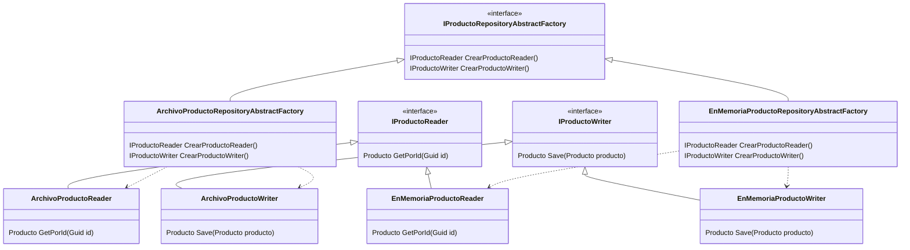

# Abstract Factory

```mermaid
classDiagram
    class IProductoRepositoryAbstractFactory {
        IProductoReader CrearProductoReader()
        IProductoWriter CrearProductoWriter()
    }   

    class ArchivoProductoRepositoryAbstractFactory{
        IProductoReader CrearProductoReader()
        IProductoWriter CrearProductoWriter()
    }

    class EnMemoriaProductoRepositoryAbstractFactory{
        IProductoReader CrearProductoReader()
        IProductoWriter CrearProductoWriter()
    }

    IProductoRepositoryAbstractFactory <|-- ArchivoProductoRepositoryAbstractFactory
    IProductoRepositoryAbstractFactory <|-- EnMemoriaProductoRepositoryAbstractFactory
 
    class IProductoReader {
            Producto GetPorId(Guid id)
    } 

    class ArchivoProductoReader{
        Producto GetPorId(Guid id)
    }

    class EnMemoriaProductoReader{
        Producto GetPorId(Guid id)
    }

    IProductoReader <|--ArchivoProductoReader
    IProductoReader <|--EnMemoriaProductoReader
 
    class IProductoWriter{
        Producto Save(Producto producto)
    }

    class ArchivoProductoWriter{
        Producto Save(Producto producto)
    }

    class EnMemoriaProductoWriter{
        Producto Save(Producto producto)
    }

    IProductoWriter <|--ArchivoProductoWriter
    IProductoWriter <|--EnMemoriaProductoWriter

    <<interface>> IProductoRepositoryAbstractFactory
    <<interface>> IProductoReader
    <<interface>> IProductoWriter    

    ArchivoProductoRepositoryAbstractFactory ..> ArchivoProductoReader
    ArchivoProductoRepositoryAbstractFactory ..> ArchivoProductoWriter

    EnMemoriaProductoRepositoryAbstractFactory ..> EnMemoriaProductoReader
    EnMemoriaProductoRepositoryAbstractFactory ..> EnMemoriaProductoWriter 
```
